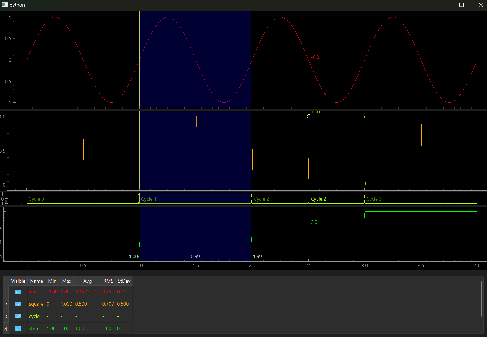

# pyqtgraph-scope-plots
Scope like plot utilities for pyqtgraph

A collection of PyQtGraph-based widgets for creating interactive plotting tools, especially for (but not limited to) electrical / digital waveforms.

The demonstration [example.py](example.py) script, showing three line plots and a string-valued waveform plot, with a user-defined region and a live (mouseover) cursor showing data values.
It can also load CSVs with any number of columns, where the first column is the common x-axis, and other columns may be sparse and either of numeric type (visualized as a line plot) or string type (viewed as an enum plot).

Major components:
- `PlotItem` Interactivity Mixins: these can be mixed in to a custom `PlotItem` to add interactivity:
    - `SnappableHoverPlot`: snaps to the data point nearest the cursor, providing a visual target.
      The snapped point is also available for tools to build upon.
    - `LiveCursorPlot`: provides a vertical line over the mouse cursor, that shows the values of all intersecting points.
      Uses the snapping function to snap to the nearest data point.
    - `RegionPlot`: provides a user-defined region (via double-click) that shows the x-axis distance between the cursors.
      The region data is also available for tools to build upon.
    - `PointsOfInterestPlot`: allows users to add arbitrarily many points of interest (vertical lines) that shows the values of all intersecting points.
- `EnumWaveformPlot`: a `PlotItem` that renders string-valued data as a waveform.
- `MultiPlotWidget`: a `QSplitter` widget with multiple plots stacked vertically, with a common x-axis.
  These mixin classes are provided to add functionality:
    - `LinkedMultiPlotWidget`: adds functionality to link the live cursor, region, and points of interest (from interactivity mixins) between plots.
    - `DroppableMultiPlotWidget`: allows an externally-initiated drag-and-drop operation to reorganize (rearranging and combining / overlaying) plots.
- `SignalsTable`: `QTableWidget` that lists signals and provides an extensible base for additional columns.
  These mixin classes are provided to add functionality:
    - `StatsSignalsTable`: adds stats (like min, max, avg) per-row, optionally over a selected x-range.
    - `DeleteableSignalsTable`: adds delete-row functionality that fires a signal (and does nothing else - deletion must be handled externally)
    - `TransformsSignalTable`: allows the user to set a function (using a subset of Python) for each row to transform the input data.
      This function has access to the x (as `t`) and y (as `x`) values of the current point as well as other rows at the same index (as `data`).
    - `DraggableSignalsTable`: enables initiating a drag-and-drop operation, to be dropped into some external widget.
- `PlotsTableWidget`: combines `MultiPlotWidget` and `SignalsTable` (with all their mixins), linked with each other, into a `QSplitter`.
    - Provides an extension point for an optional widget on the bottom right through `_init_controls`, for example to add a controls box.
    - The data items are first initialized with `_set_data_items` (with name, color, and plot-type of each data item), then data can be updated with `_set_data` (as a name-to-(xs, ys) mapping).
